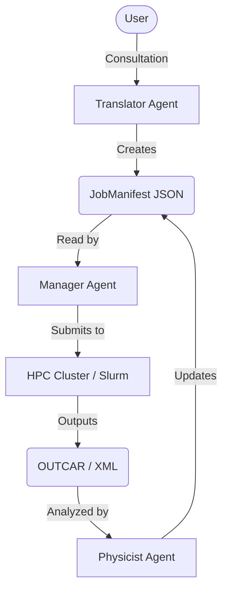

# VASP Automation Platform (v2.0)

[](https://opensource.org/licenses/MIT)

> **Status**: Service-Oriented Architecture (Ready for Multi-Agent Scale)

An AI-driven platform for high-throughput Density Functional Theory (DFT) calculations using VASP. This project transitions from linear scripting to a modular, event-driven architecture designed for multi-agent collaboration between an **Architect** (Translator), a **Sysadmin** (Manager), and an **Expert** (Physicist).

---

## 🏗️ Architecture

The platform operates on a "Manifest-Driven" workflow. Agents do not call each other directly; they communicate by reading and updating a shared **Data Contract** (`JobManifest`).



---

## 🚀 Quick Start

### 1. Prerequisites
-   Python 3.9+
-   Access to Google Gemini API
-   Access to Materials Project API

### 2. Environment Setup
Create a `.env` file in the root directory with the following variables:

| Variable | Description | Required |
| :--- | :--- | :--- |
| `GOOGLE_API_KEY` | API Key for Google Gemini models | Yes |
| `MP_API_KEY` | API Key for Materials Project | Yes |
| `PROJECT_ROOT` | Absolute path to the repository root | Yes |
| `POTENTIALS_DIR` | Directory containing VASP POTCAR files | Yes |

### 3. Execution
Run the orchestrator:
```bash
python3 main.py
```

### 4. The Workflow
1.  **Consult**: "I need a band structure for GaN."
2.  **Negotiate**: The Agent looks up the structure, checks the Band Gap, and proposes a customized `INCAR` strategy.
3.  **Approve**: You type "Run", and the Agent generates the full job directory structure.

---

## 📂 Project Structure

```text
.
├── LICENSE
├── README.md                  # This file
├── main.py                    # Entry point
├── requirements.txt           # Python dependencies
└── vasp_platform/
    ├── config/
    │   └── README.md          # Configuration documentation
    ├── data/
    │   └── README.md          # Data storage documentation
    └── src/
        ├── core/
        │   ├── llm.py         # LLM Interface
        │   └── state.py       # Session State Management
        ├── manager/
        │   └── SKILL.md       # Manager Agent Instructions
        ├── physicist/
        │   └── SKILL.md       # Physicist Agent Instructions
        ├── translator/
        │   ├── SKILL.md       # Translator Agent Instructions
        │   ├── agent.py       # Translator Agent Implementation
        │   ├── builder.py     # INCAR File Generator
        │   └── tools.py       # Physics & Crystallography Tools
        └── utils/
            └── ux.py          # User Experience Utilities
```

---

## 📂 Deep Analysis of Modules

The source code (`vasp_platform/src`) is divided into distinct domains:

### 1. Core Layer (`src/core`)
The "Brain Stem" of the application.
-   **`llm.py` (Class: `GoogleGenAIAdapter`)**: A robust adapter for Google GenAI, handling API quotas, retries, and model configuration.
-   **`state.py` (Class: `AgentState`)**: Manages the short-term memory of the active agent session, tracking job manifests and conversation history.

### 2. Translator Module (`src/translator`)
The "Architect" responsible for designing the calculation.
-   **Documentation**: [Translator Skill](vasp_platform/src/translator/SKILL.md)
-   **`agent.py` (Class: `TranslatorAgent`)**: The main orchestrator that interacts with the user to define simulation parameters.
-   **`tools.py` (Class: `TranslatorTools`)**: Provides rigorous scientific validation. Uses Pymatgen to compare lattice angles and classify crystal systems.
-   **`builder.py` (Class: `IncarBuilder`)**: Logic-heavy class for generating `INCAR` files, featuring Run-Length Encoding (RLE) for reduced `MAGMOM` tags.

### 3. Utilities (`src/utils`)
-   **`ux.py` (Class: `Thinking`)**: A context manager that provides visual feedback (spinners/messages) during long-running operations.

### 4. Manager Module (`src/manager`)
The "Sysadmin" responsible for execution.
-   **Documentation**: [Manager Skill](vasp_platform/src/manager/SKILL.md)
-   **`connection.py`**: Handles SSH connections to the HPC cluster via a **Bastion Host (Gateway)** using `fabric`.
-   **`workflow.py`**: Implements the VASP State Machine (`Relax` -> `Static` -> `Bands`) and handles self-correction logic.
-   **`ai_debugger.py`**: Analyzes VASP logs with Google Gemini to suggest fixes for complex crashes (e.g., mixing errors).
-   **`vaspkit_driver.py`**: Wraps `vaspkit` for automated K-Point generation and band-structure data extraction.
-   **`daemon.py`**: The persistent service loop that syncs files and triggers workflows.

### 5. Physicist Module (`src/physicist`) [Planned]
The "Scientist" responsible for analysis.
-   **Documentation**: [Physicist Skill](vasp_platform/src/physicist/SKILL.md)
-   Checks `EDIFF` (Electronic) and `EDIFFG` (Ionic) limits to certify scientific validity.

---

## 📂 Infrastructure & Scalability

### ⚙️ Configuration (`vasp_platform/config/`)
-   **[Read More](vasp_platform/config/README.md)**
-   Decouples the codebase from the environment.
-   Supports **Cluster Profiles** for multi-HPC deployments.

### 💾 Data Lake (`vasp_platform/data/`)
-   **[Read More](vasp_platform/data/README.md)**
-   **Manifests**: The persistent record of intent.
-   **Simulations**: The ephemeral working directory (mirrors scratch).

---

*Developed by the VASP Automation Team.*
